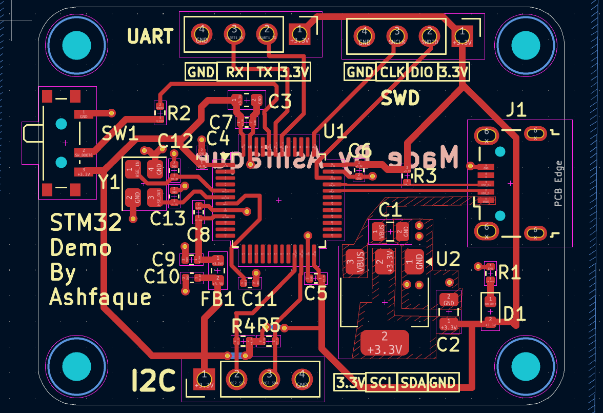

# STM32 Demo PCB Design
 
My first STM32 microcontroller PCB design, built following the **Phil's Lab STM32 PCB Design tutorial series**. This project was a foundational learning experience in professional PCB design workflow — from schematic capture to layout, design rule checking, and Gerber file generation for manufacturing.
 
---
 
## Preview
 
### Schematic

 
### PCB Layout

 
### 3D View

 
---
 
## Project overview
 
| Property | Details |
|---|---|
| **MCU** | STM32 |
| **EDA Tool** | KiCad |
| **Board layers** | 2-layer |
| **Design reference** | Phil's Lab — STM32 PCB Design Series |
| **Status** | Design complete — Gerbers exported |
 
---
 
## Files included
 
### KiCad project files
| File | Description |
|---|---|
| `STM32_1st_Project.kicad_pro` | KiCad project file |
| `STM32_1st_Project.kicad_sch` | Schematic |
| `STM32_1st_Project.kicad_pcb` | PCB layout |
| `STM32_1st_Project.kicad_prl` | Local settings |
 
### Gerber files (manufacturing-ready)
| File | Layer |
|---|---|
| `STM32_1st_Project-F_Cu.gbr` | Front copper layer |
| `STM32_1st_Project-B_Cu.gbr` | Back copper layer |
| `STM32_1st_Project-F_Mask.gbr` | Front solder mask |
| `STM32_1st_Project-B_Mask.gbr` | Back solder mask |
| `STM32_1st_Project-F_Paste.gbr` | Front solder paste |
| `STM32_1st_Project-B_Paste.gbr` | Back solder paste |
| `STM32_1st_Project-F_Silkscreen.gbr` | Front silkscreen |
| `STM32_1st_Project-B_Silkscreen.gbr` | Back silkscreen |
| `STM32_1st_Project-Edge_Cuts.gbr` | Board outline |
| `STM32_1st_Project-PTH.drl` | Plated through-holes drill file |
| `STM32_1st_Project-NPTH.drl` | Non-plated through-holes drill file |
 
### Assembly files
| File | Description |
|---|---|
| `STM32_1st_Project-top-pos.csv` | Top component placement positions |
| `STM32_1st_Project-bottom-pos.csv` | Bottom component placement positions |
 
---
 
## What I learned
 
- STM32 microcontroller schematic design and symbol placement
- Decoupling capacitor placement for power supply stability
- 2-layer PCB stackup and copper pour design
- Design Rule Check (DRC) and error resolution
- Gerber file generation and validation for PCB manufacturing
- KiCad project workflow from schematic to production files
---
 
## Tools used
 

 
---
 
## Reference
 
This design follows the **Phil's Lab STM32 PCB Design tutorial series** — an excellent resource for learning professional PCB design practices with KiCad.
 
> Phil's Lab: [https://www.youtube.com/@PhilsLab](https://www.youtube.com/@PhilsLab)
 
---
 
*Mymensingh Engineering College — EEE Department*
